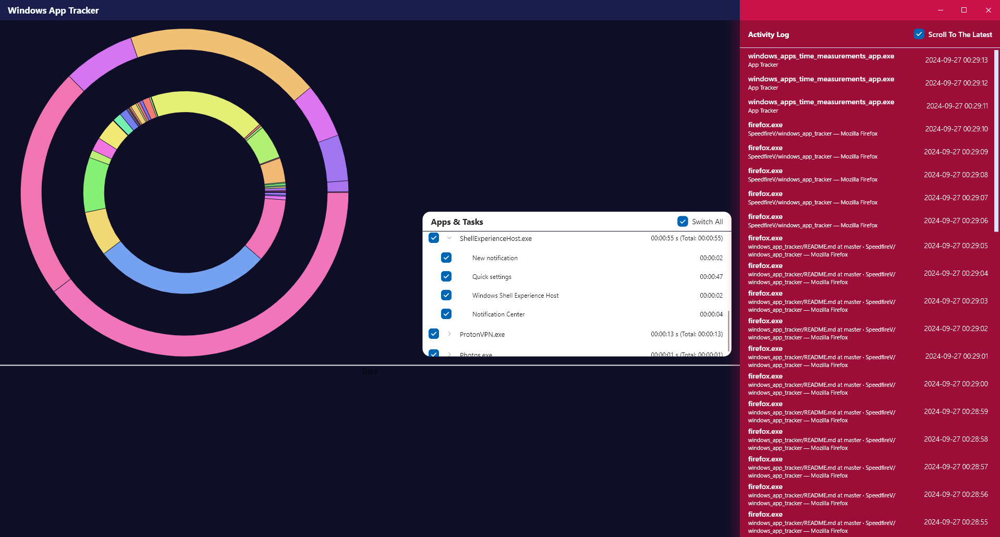
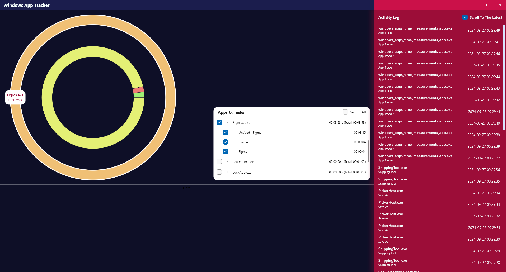
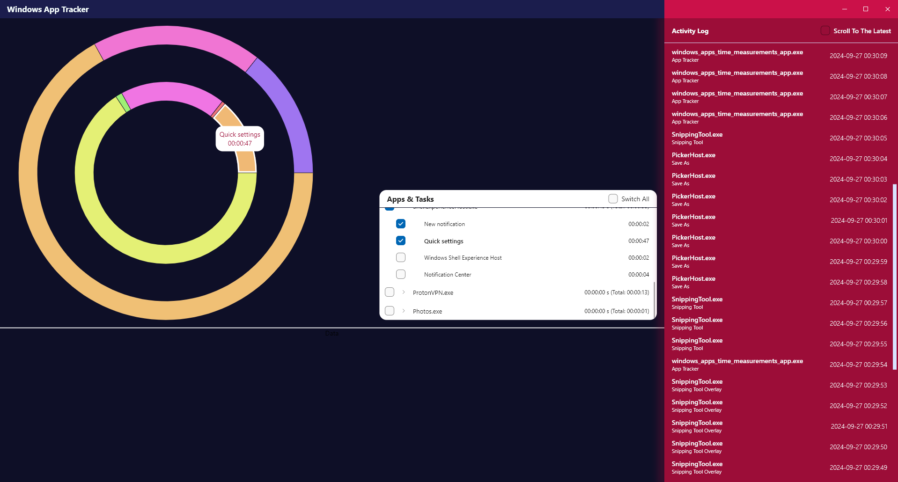

# App Tracker

App Tracker is a Flutter-based Windows desktop application designed to help users track the time they spend using different apps on their PC. The app operates in the background, logging active apps and windows in 1-second intervals, storing this data locally using an SQFlite database. It features an interactive pie chart for visualizing usage and includes an activity log that shows recent app activity.

## Features

- **Automatic App Tracking**: Logs the active app every second, tracking the app name and the currently open window.
- **Local Storage**: Stores the data in an SQFlite database with columns for app name, task name, and timestamp.
- **Interactive Pie Chart**: Displays app usage in a pie chart, allowing users to filter and deselect apps for a cleaner visualization.
- **Activity Log**: Shows the last 50 opened apps with timestamps in the sidebar.
- **System Tray Support**: The app runs in the system tray, continuing to track apps even when minimized.
- **Autostart on System Boot**: The app starts automatically when Windows boots, ensuring continuous tracking.

## Used Packages

The following packages are used in the development of **App Tracker**:

- **[Bloc](https://pub.dev/packages/bloc)**: For state management, allowing efficient handling of UI states and business logic.
- **[SQFlite](https://pub.dev/packages/sqflite)**: Manage database & store data about app usage.
- **[freezed](https://pub.dev/packages/freezed)**: Used for generating immutable classes with helpful utilities like `copyWith` and equality comparison.
- **[fluent_ui](https://pub.dev/packages/fluent_ui)**: Provides Windows-like UI components, ensuring the app's interface matches the native Windows look and feel.

- **[win32](https://pub.dev/packages/win32)**: Used for accessing low-level Windows functions to manage system tray interactions and background processes.
- **[fl_chart](https://pub.dev/packages/fl_chart)**: A package used to display charts, including the interactive pie chart for visualizing app usage.

## Table Structure

The app uses a single table in the SQFlite database to store the tracked data. The table has the following structure:

| Column      | Type      | Description                                                              |
| ----------- | --------- | ------------------------------------------------------------------------ |
| `appName`   | STRING    | The executable file name of the app (e.g., `firefox.exe`).                |
| `taskName`  | STRING    | The name of the currently open window (e.g., `ChatGPT - Mozilla Firefox`).|
| `createdAt` | TIMESTAMP | The time when the app was in the foreground.                             |

## How It Works

1. **App Tracking**: The app checks which app is in the foreground every second and logs the app’s executable name and active window title in the SQFlite database.
2. **Interactive Pie Chart**: Users can view their app usage over time via a pie chart, which allows them to deselect specific apps to make the data more readable.
3. **Activity Log**: The latest 50 apps that were active (in the last 50 seconds) are displayed in an activity log on the sidebar, with timestamps for each entry.
4. **System Tray Functionality**: The app minimizes to the system tray but continues collecting data in the background. It starts automatically with the system to ensure no usage is missed.

## Usage

Once the app is running, it will begin tracking your active apps and window names immediately. You can interact with the app as follows:

- **View Usage**: Open the main window to view your app usage in an interactive pie chart. Deselect apps in the chart to filter out apps you're not interested in.
- **Check Activity Log**: View the last 50 active apps along with their timestamps in the sidebar.
- **Minimize to System Tray**: The app will continue tracking apps in the background when minimized to the system tray.
- **Autostart**: The app starts automatically with your system and will begin tracking apps right away.

## Screenshots

*Basic App View*

*Chart Data App Selection*

*Chart Data Task Seletion & Activity Log Scrolling*

## Future Plans

- **Additional Chart Types**: Add support for other chart types such as linear charts to better visualize app usage over time.
- **More Filters**: Implement advanced filtering options like date range selection and query-based searches for more granular analysis.
- **Interactive Table**: Create an interactive table that sums total time spent on each app and allows users to manage and explore the data easily.
- **Export to CSV**: Make it possible to export the tracked app data to CSV for further analysis or reporting.

<a title="Made with Fluent Design" href="https://github.com/bdlukaa/fluent_ui"><imgsrc="https://img.shields.io/badge/fluent-design-blue?style=flat-square&color=gray&labelColor=0078D7"/></a>
